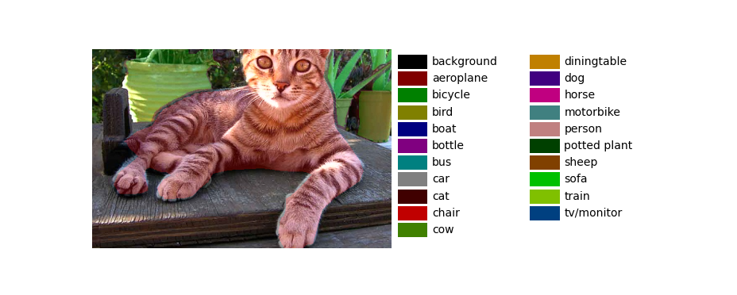

# pspnet-pytorch(modified version of https://github.com/Lextal/pspnet-pytorch)

Make the pytorch implementation of PSPNet segmentation network complete. I modify the original repo and **add the VOC2012_Segmentation Dataset process(in dataloader.py) and Set_predictor for predict and visualization in predict.py**.

### Original paper

 [Pyramid Scene Parsing Network](https://arxiv.org/abs/1612.01105)

### Details

This is a slightly different version - instead of direct 8x upsampling at the end I use three consequitive upsamplings for stability. 

### Feature extraction

Using pretrained weights for extractors - improved quality and convergence dramatically.

Currently supported:

* ResNet-18
* ResNet-34
* ResNet-50
* ResNet-101
* ResNet-152

### Dataset & DataLoadera(see the dataloader.py)

To follow the training routine in train.py you need a DataLoader that yields the tuples of the following format:

(Bx3xHxW FloatTensor x, BxHxW LongTensor y, BxN LongTensor y\_cls) where

x - batch of input images,

y - batch of groung truth seg maps,

y\_cls - batch of 1D tensors of dimensionality N: N total number of classes, 

y\_cls[i, T] = 1 if class T is present in image i, 0 otherwise

## Predictor and Visualize

See the predict.py file. I've stack the functions in the Seg_Predictor class. Example:

